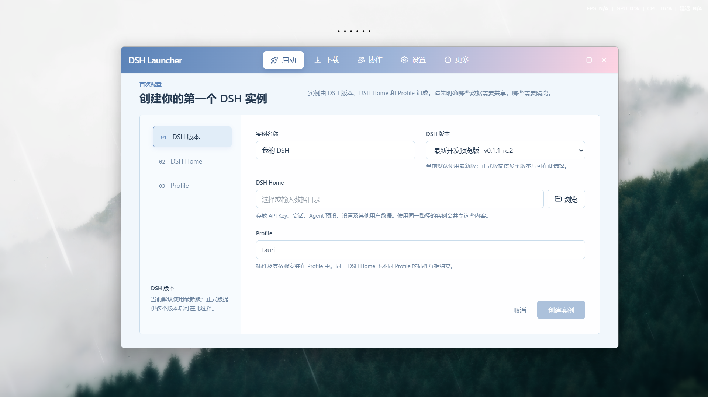
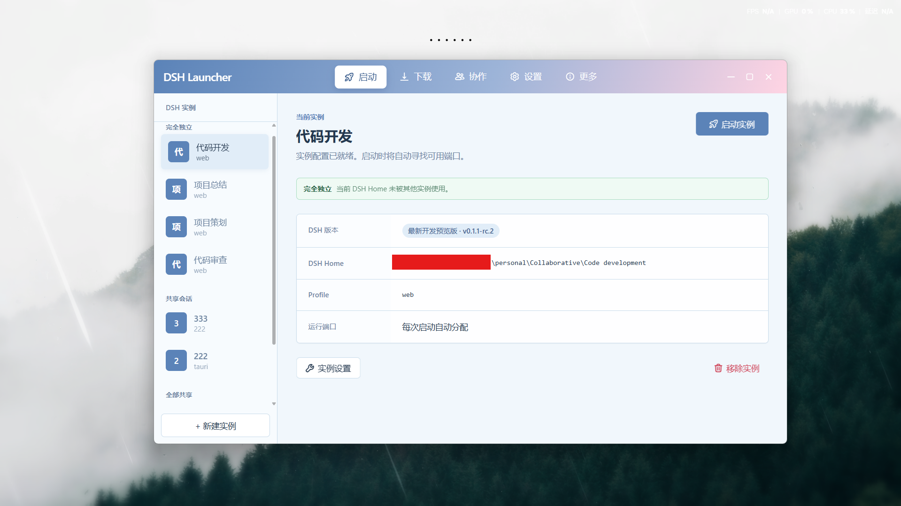
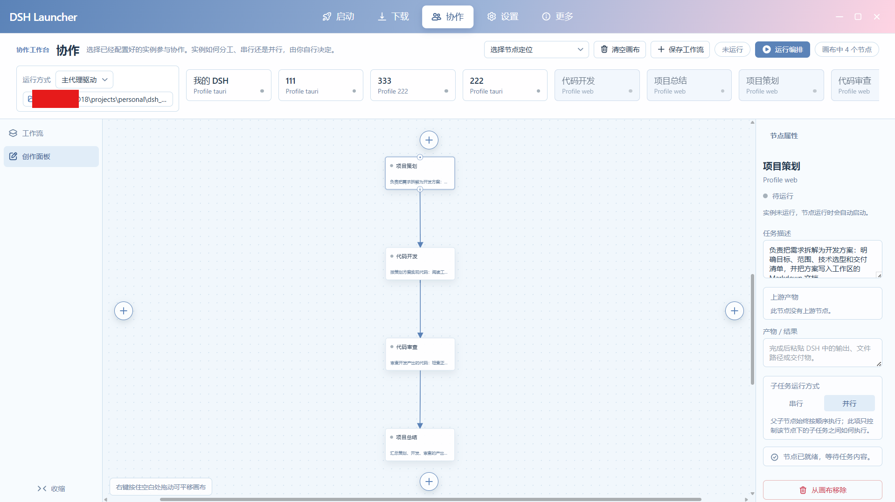
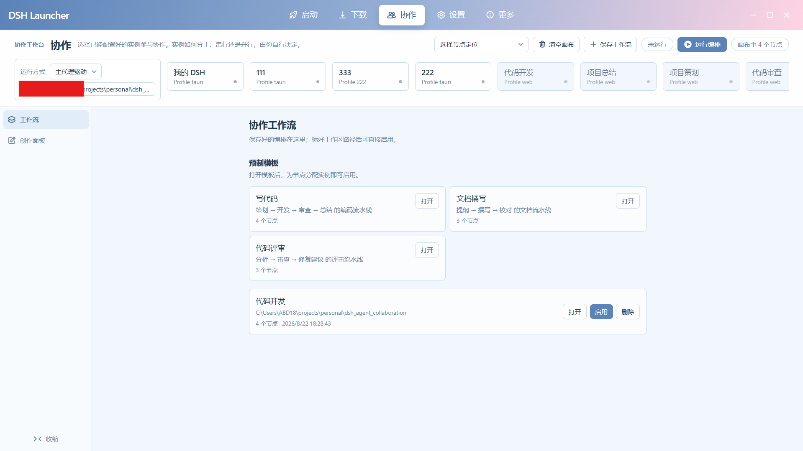
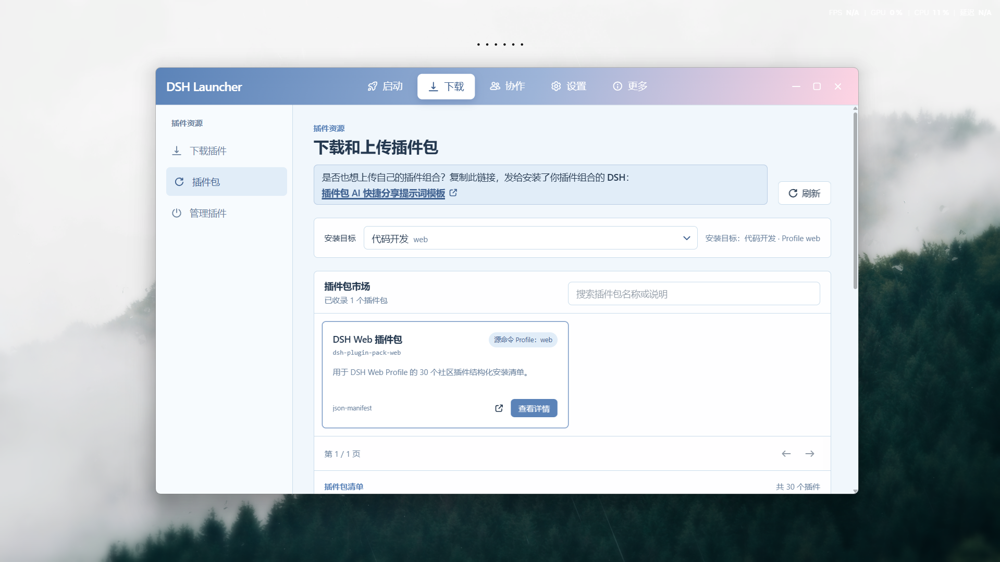
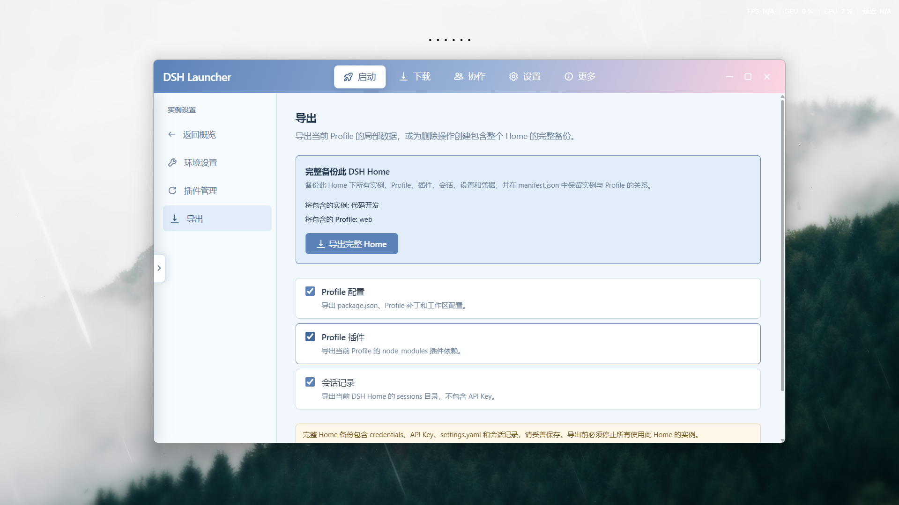
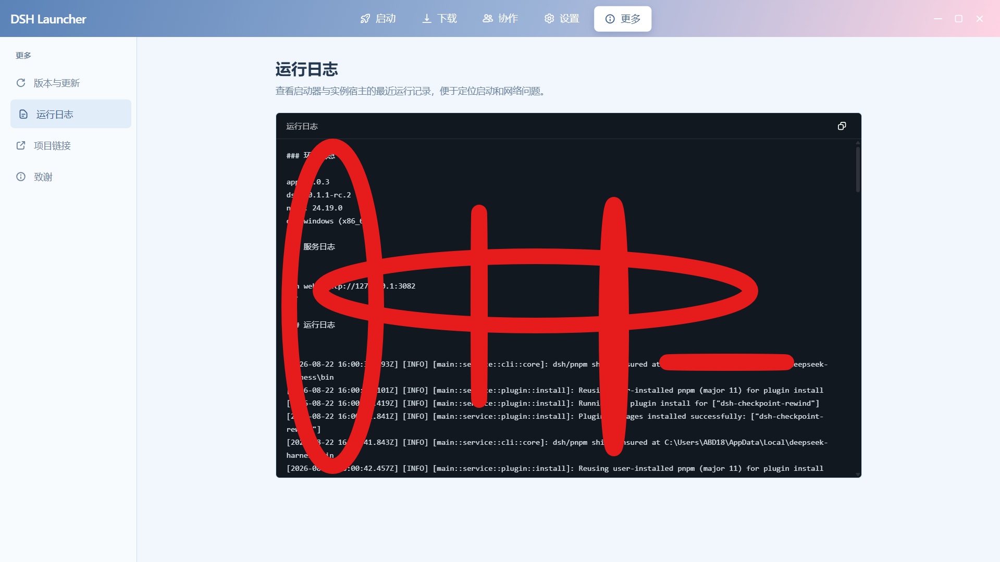
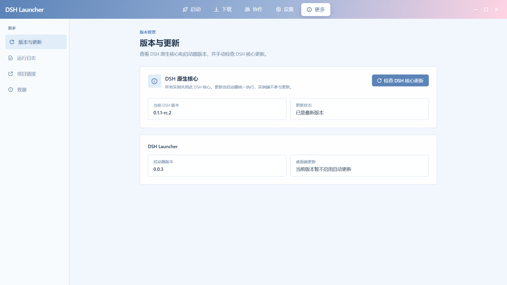
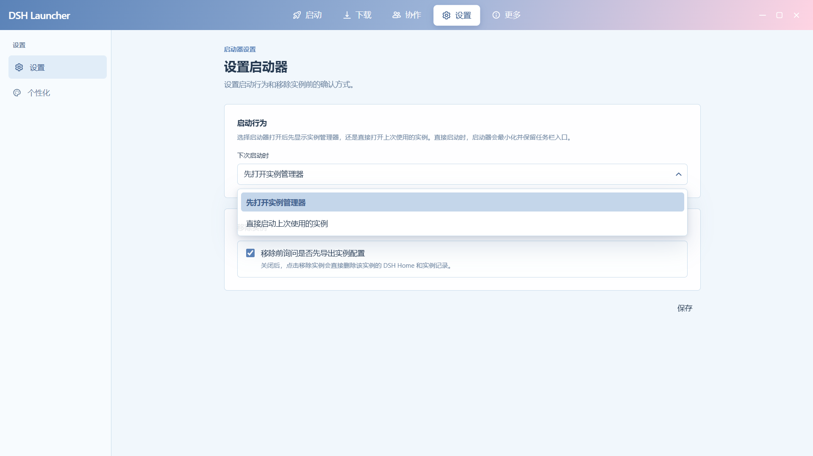
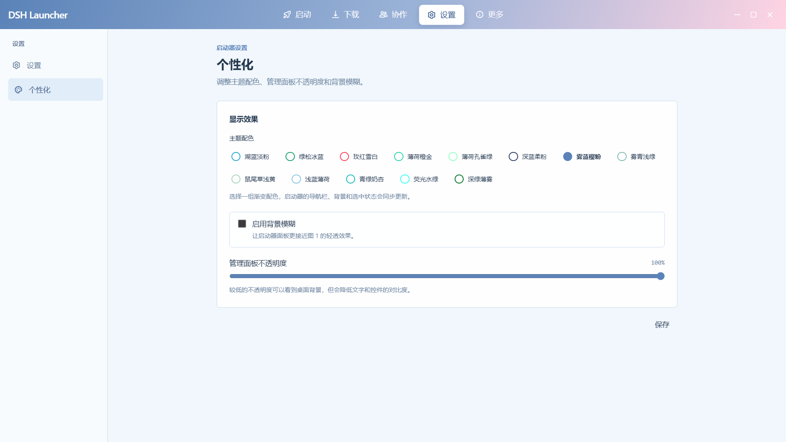

<div align="center">

# DeepSeek Harness Desktop

**DSH Launcher** · Multi-instance desktop launcher for DeepSeek Harness

> One launcher, N fully isolated DSH instances. And when you need them to, they work as a team.


</div>

<p align="center">
  
</p>

## What it is

[DeepSeek Harness](https://zhuanlan.zhihu.com/p/2071576464810682036) (DSH) is DeepSeek's open-source Agent runtime: the model *thinks*, the harness *does*. DSH writes sessions, credentials, settings, user presets, and profiles all into a single `DSH_HOME` directory.

Installing one DSH is easy. Actually *using* it well is a different story, because soon enough you'll want more than one environment:

- Run two tasks at once without mixing up sessions and API keys;
- Try different Provider / model configurations without touching your daily setup;
- Let several agents each own a slice of a big job, then combine the results.

**DSH Launcher turns all of this into everyday desktop operations.** Built on Tauri 2, the launcher and every instance run as separate processes: each instance gets its own window, taskbar entry, port, profile, and a `DSH_HOME` that nothing else can reach. This is not "folders separated" surface isolation; it's a hard runtime boundary.

## Why it's different

### 🔒 Every instance is a "fresh DSH"

Creating a brand-new `DSH_HOME` is essentially two steps: pick an empty directory, then point the `DSH_HOME` environment variable at it when spawning the DSH child process.

```bash
# 1. Pick a fresh empty directory
$fresh = "D:\dsh-instances\tauri"
New-Item -ItemType Directory -Path $fresh -Force

# 2. Pass the variable to the child process only; never pollute the system environment
$env:DSH_HOME = $fresh
dsh web   # auto-initializes the official web profile
```

Everything DSH writes lives inside `DSH_HOME`:

```text
Independent DSH_HOME
├── .credentials.yaml   API keys
├── settings.yaml       Provider / model settings
├── sessions/           Session history
├── .agent-presets/     User agent presets
├── storages/           Application storage
└── profiles/           Profile composition & patches
```

The isolation boundary is `DSH_HOME`, **not** the profile. As long as you don't copy the old directory, a new instance inherits nothing: sessions, keys, presets, and caches all start from zero. Dev, experiment, and demo environments, as many as you want, side by side, never leaking into each other.

### 🤝 Multi-instance collaboration: your own agent team

Isolation keeps instances from interfering; collaboration makes them actually work together.

In the collaboration panel you orchestrate instances like drawing a flowchart: each node is a running DSH instance owning a coarse-grained task; dependency edges connect nodes; parent-child nodes run in order while siblings can run serially or in parallel; when a node finishes, its output (text, file paths) is handed to the downstream node.

Under the hood is a lightweight RPC: the master instance dispatches, polls, and cancels tasks on running instances over the loopback HTTP API (`POST /api/<method>`). With the host locked to `127.0.0.1`, the trust boundary is explicit, and no token is needed.

Split a big job across several agents with different strengths, each advancing inside its own `DSH_HOME`, then have the master consolidate the results. That's a reusable multi-agent pipeline.

## Screenshots

<p align="center">
  
  
</p>
<p align="center"><sub>Create an instance ｜ Launch an instance</sub></p>
<p align="center">
  
  
</p>
<p align="center"><sub>Collaboration canvas for building your workflows ｜ Reuse a workflow you already created</sub></p>
<p align="center">
  
  
</p>
<p align="center"><sub>Plugin pack download ｜ Plugin-pack marketplace: a second-level community inside the plugin community for downloading and sharing plugin combos</sub></p>
<p align="center">
  
  
</p>
<p align="center"><sub>Export user configuration ｜ One-click copy of full run logs to quickly pinpoint plugin-related instance errors</sub></p>
<p align="center">
  
  
</p>
<p align="center"><sub>Dual isolation, resilient to nearly any DSH update ｜ Lean config: use the multi-instance mechanism to flexibly fix startup logic when errors occur</sub></p>
<p align="center">
  
</p>
<p align="center"><sub>Personalized launcher palette</sub></p>

## Features

| Capability | Description |
| --- | --- |
| Instance lifecycle | Create, start, stop, restart, remove; ports are probed automatically and only real listening ports are shown |
| Hard isolation | Each instance has its own `DSH_HOME` / window / port / profile; instances sharing a Home are blocked from running in parallel |
| Collaboration | Canvas-based orchestration of instances, serial / parallel execution, artifacts flow along the dependency chain |
| Plugin ecosystem | Community plugin catalog + plugin-pack marketplace; npm, GitHub, and trusted HTTP(S) packages |
| Background install | Per-package progress, real progress events, cancellation kills the whole child process tree |
| Runtime management | DSH runtime download, checksum verification, transactional replacement; updates never lose instance data |
| Export & backup | Selective profile export and full Home backup; sensitive data stays on the machine |
| Privacy | Keys, sessions, settings, and logs are stored locally only, never shipped to the repo |

## Architecture

```text
┌──────────────────────────────────────────────────────────────┐
│                 DSH Launcher process (Tauri 2)               │
│        Instance registry · lifecycle · plugins · runtime ·   │
│                          tray · IPC                          │
└───────────────┬───────────────────────────────┬──────────────┘
                │ process isolation: window /    │ RPC: dispatch / poll / cancel
                │        port / env vars         │
   ┌────────────▼─────────┐   ┌─────────────────▼──────────────┐
   │     Instance host 1  │   │        Instance host 2         │
   │  own window · port   │   │     own window · port          │
   │  own taskbar entry   │   │     own taskbar entry          │
   └────────────┬─────────┘   └─────────────────┬──────────────┘
                ▼                               ▼
        DSH native Web                   DSH native Web
        DSH_HOME = A                      DSH_HOME = B
```

The launcher only *manages*; it never touches DSH core: no rewriting of DSH's web routes, sessions, API keys, agent presets, or plugin logic, only the external runtime contract. As a result, DSH's own updates usually don't require the wrapper to change.

## Quick start

- **Installer**: download `x64-setup.exe` from [GitHub Releases](https://github.com/baihejiangnan/deepseek-harness-desktop/releases), install, and launch from the Start menu or desktop shortcut.
- **Portable (Windows x64)**: download [deepseek-harness-desktop.exe](https://raw.githubusercontent.com/baihejiangnan/deepseek-harness-desktop/master/release/windows/deepseek-harness-desktop.exe) and double-click to run — no installation required.

The first run prepares the Node.js runtime and the DSH runtime over the network.

> The primary build target is Windows x64; macOS / Linux bundles must be built on their respective platforms.

## Build from source

```bash
pnpm install
pnpm tauri dev                   # development
pnpm tauri build --bundles nsis  # Windows installer
```

The installer lands in `src-tauri/target/release/bundle/nsis/`. A portable Windows exe (double-click to run, no installation required) is also available: [deepseek-harness-desktop.exe](https://raw.githubusercontent.com/baihejiangnan/deepseek-harness-desktop/master/release/windows/deepseek-harness-desktop.exe). Development details: [docs/DEVELOPMENT.md](docs/DEVELOPMENT.md).

## Privacy

API keys, tokens, passwords, sessions, DSH Homes, profiles, logs, caches, and local settings **never** enter the repository or release assets. Build directories such as `dist`, `src-tauri/target`, and `node_modules` are ignored. The source repository contains only project code, build configs, docs, public static assets, and release packages.

## License

[MIT](./LICENSE) + [additional terms](./LICENSE.details) (non-commercial)

---

If DSH Launcher helps you, give it a star, or share it with a friend who lives in DSH.
