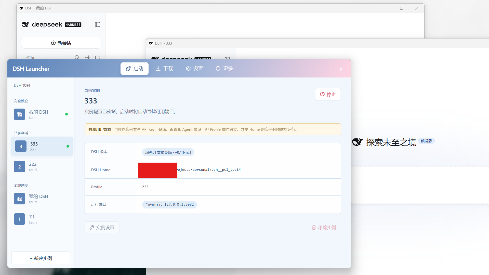
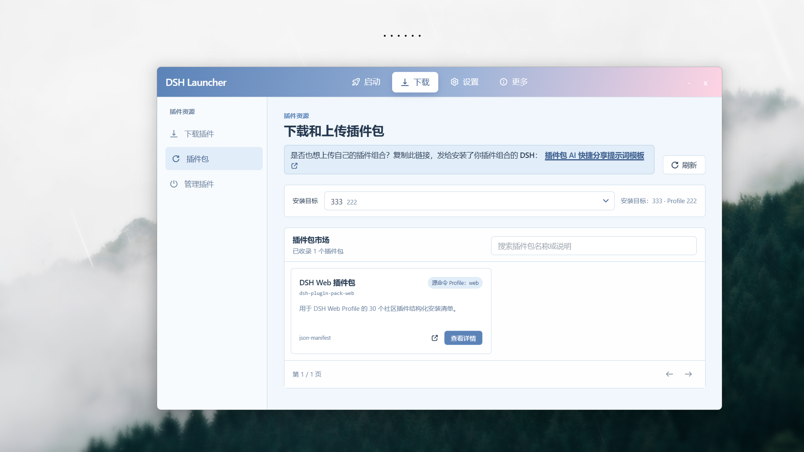
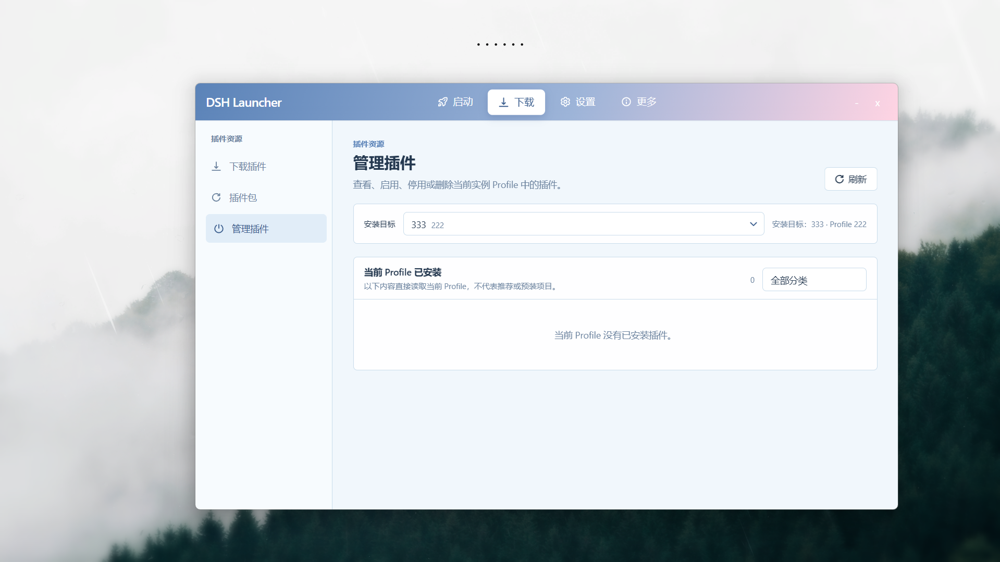

<div align="center">

# DeepSeek Harness Desktop

**DSH Launcher** · 多实例 DSH 桌面启动器

> 一个启动器，N 个完全隔离的 DSH 实例；需要时，它们还能并肩作战。


</div>


## 它是什么

DSH是 DeepSeek 官方开源的 Agent 运行时：模型负责"想"，Harness 负责"做"。它会将会话、凭据、设置、用户预设和 Profile 全部写进一个 `DSH_HOME` 目录。

装一个 DSH 很简单，但要用好它，很快就会发现缺一个"多开"的能力：

- 想同时跑两个任务，又不想让会话和 API Key 混在一起；
- 想试试不同的 Provider / 模型配置，又不想动日常环境；
- 想让几个 Agent 各管一摊，最后把结果合起来。

**DSH Launcher 把这些变成了桌面上的日常操作。** 它基于 Tauri 2 构建，启动器与每个实例都是独立进程：每个实例拥有独立的窗口、任务栏入口、端口、Profile，以及互不相通的 `DSH_HOME`。这里的隔离不是"分文件夹"的表面功夫，而是运行时的硬边界。

## 为什么不同

### 🔒 每个实例，都是"全新的 DSH"

创建全新 `DSH_HOME` 本质上只有两步：选一个全新的空目录，然后在启动 DSH 子进程时把 `DSH_HOME` 环境变量指向它。

```bash
# 1. 选一个全新的空目录
$fresh = "D:\dsh-instances\tauri"
New-Item -ItemType Directory -Path $fresh -Force

# 2. 启动时只把这个环境变量传给子进程，不污染系统环境变量
$env:DSH_HOME = $fresh
dsh web   # 自动初始化官方 web profile
```

DSH 会把一切写进 `DSH_HOME`：

```text
独立 DSH_HOME
├── .credentials.yaml   API Key
├── settings.yaml       Provider / 模型设置
├── sessions/           会话历史
├── .agent-presets/     用户 Agent 预设
├── storages/           应用存储
└── profiles/           Profile 组成与补丁
```

隔离的边界是 `DSH_HOME`，不是 Profile。只要不复制旧目录，新实例就不会继承任何旧数据：会话、Key、预设、缓存全部从零开始。开发环境、实验环境、演示环境，想要几套就要几套，互不干扰，永远不会"串味"。

### 🤝 多实例协作：一支属于你的 Agent 团队

隔离保证互不干扰，而协作让这些隔离的实例真正一起干活。

在协作面板中，你可以像画流程图一样编排多个实例：每个节点是一个运行中的 DSH 实例，负责一段粗粒度任务；节点之间用依赖连线连接，父子节点按顺序执行，兄弟节点可以串行或并行；每个节点完成后，把产物（文本、文件路径）交给下游继续处理。

底层是一条轻量 RPC：主实例通过 loopback HTTP 接口（`POST /api/<method>`）向运行中的实例下发、轮询和取消任务。Host 限制为 `127.0.0.1`，信任边界清晰，无需额外令牌。

把一个大任务拆给几个各有所长的 Agent，各自在独立的 `DSH_HOME` 里推进，最后由主实例汇总。这就是一条可复用的多 Agent 流水线。

## 界面预览

<p align="center">
  
  
</p>
<p align="center">
  
  
</p>

## 功能一览

| 能力 | 说明 |
| --- | --- |
| 多实例生命周期 | 创建、启动、停止、重启、移除；端口自动探测，只展示真实监听的端口 |
| 完全隔离 | 每个实例独立 `DSH_HOME` / 窗口 / 端口 / Profile，共享同一 Home 的实例禁止并行 |
| 协作编排 | 画布编排实例依赖，串行 / 并行执行，产物沿链路传递 |
| 插件生态 | 社区插件目录 + 插件包市场，支持 npm、GitHub 与受信任的 HTTP(S) 包 |
| 后台安装 | 插件逐条安装、真实进度、随时取消并终止整个子进程树 |
| Runtime 管理 | DSH 运行时下载、摘要校验、事务式替换，更新不丢任何实例数据 |
| 导出与备份 | Profile 选择性导出、完整 Home 备份，敏感数据只留在本机 |
| 隐私边界 | Key、会话、设置、日志全部本地存储，不进仓库、不上传 |

## 架构总览

```text
┌──────────────────────────────────────────────────────────────┐
│                 DSH Launcher 进程（Tauri 2）                  │
│        实例注册表 · 生命周期 · 插件 · Runtime · 托盘 · IPC      │
└───────────────┬───────────────────────────────┬──────────────┘
                │ 进程隔离：窗口 / 端口 / 变量    │ RPC：下发 / 轮询 / 取消
   ┌────────────▼─────────┐   ┌─────────────────▼──────────────┐
   │      实例宿主 1       │   │         实例宿主 2              │
   │  独立窗口 · 独立端口  │   │  独立窗口 · 独立端口            │
   │  独立任务栏入口       │   │  独立任务栏入口                 │
   └────────────┬─────────┘   └─────────────────┬──────────────┘
                ▼                               ▼
        DSH 原生 Web                     DSH 原生 Web
        DSH_HOME = A                      DSH_HOME = B
```

启动器只负责"管理"，不触碰 DSH 核心：不改写 DSH 的 Web 路由、会话、API Key、Agent 预设或插件逻辑，只维护外部的运行契约。因此 DSH 自身的更新通常不需要封装层同步改造。

## 快速开始

从 [GitHub Releases](https://github.com/baihejiangnan/deepseek-harness-desktop/releases) 下载 `x64-setup.exe` 安装器，安装后从开始菜单或桌面快捷方式启动。首次运行需要联网准备 Node.js Runtime 和 DSH Runtime。

> 当前主构建目标为 Windows x64；macOS / Linux 发行包需在对应平台自行构建。

## 从源码构建

```bash
pnpm install
pnpm tauri dev                 # 开发调试
pnpm tauri build --bundles nsis   # 产出 Windows 安装包
```

安装包输出到 `src-tauri/target/release/bundle/nsis/`。开发细节见 [docs/DEVELOPMENT.md](docs/DEVELOPMENT.md)。

## 隐私边界

API Key、Token、密码、会话、DSH Home、Profile、日志、缓存和本地设置**不会**进入仓库或发布包。`dist`、`src-tauri/target`、`node_modules` 等构建目录已被忽略。源码仓库只包含项目代码、构建配置、文档、公开静态资源和发行包。

## License

[MIT](./LICENSE) + [补充条款](./LICENSE.details)（非商业用途）

---

如果 DSH Launcher 帮到了你，欢迎点个 Star，或者把它分享给同样在用 DSH 的朋友。
