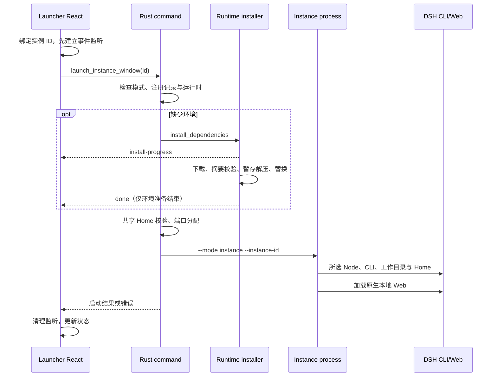

# DSH Launcher 架构与数据边界

核对基线：v0.0.10 源码（tag 与发行包均已产出，见 [发布检查](RELEASING.md)）；开发分支工作区另有未提交改动，行为以当前代码为准。本文由原 LAUNCHER_V1.md 整理而来。开发约束以根目录 [AGENTS.md](../AGENTS.md) 为入口；调用协议见 [IPC_CONTRACTS.md](IPC_CONTRACTS.md)，发布见 [RELEASING.md](RELEASING.md)。文中约束与当前实现差距见 [TODO](../TODO.md)，附属清理仍是 [待实施方案](INSTANCE_CLEANUP_PLAN.md)。

## 目标

桌面应用启动后先进入实例管理器，由用户明确选择运行环境，再启动 DSH。启动器与每个 DSH 实例使用独立的 Tauri 进程和窗口；实例窗口直接加载 DSH 原生 Web 地址，启动器只负责注册表、依赖准备和生命周期管理。

## 进程模型

同一个可执行文件根据启动参数进入不同宿主模式：

```text
dsh-launcher.exe --mode launcher
dsh-launcher.exe --mode instance --instance-id <id>
```

`launcher` 进程拥有实例管理器窗口和启动器任务栏标识。每次启动实例时，启动器派生一个新的 `instance` 进程；实例进程只绑定自己的实例记录、端口和 Harness 进程，并创建独立窗口。

Windows 任务栏 AppUserModelID 约定为：

```text
io.github.baihejiangnan.dsh-launcher.launcher
io.github.baihejiangnan.dsh-launcher.instance.<instance-id>
```

Windows 路径在实例窗口出现且服务健康检查通过后才完成启动调用，前端随后最小化启动器，保持进程和任务栏按钮存在。非 Windows 当前调用以端口占用加短暂等待判定，尚未与 Windows 验证对齐；不能宣称全平台窗口和健康检查完全相同。关闭实例窗口只停止对应 Harness，不退出启动器或其他实例；非 Windows 宿主以独立进程组启动，停止时按进程组终止整棵树，不再只杀直接子进程而遗留 DSH。

## 实例模型

一个实例记录由以下内容组成：

```text
DSH version + DSH_HOME + Profile + runtime launch state
```

- `DSH version`：所有实例共用启动器当前选中的运行时；注册表中的兼容字段不能视为每个实例独立选择运行时的能力。
- `DSH_HOME`：保存 API Key、会话、Agent 预设、设置及其他用户数据。
- `Profile`：保存插件、补丁及插件依赖。
- 运行状态：进程、PID 和端口仅属于本次运行，不写入实例记录。

## 共享与隔离

| 组合 | 用户数据 | 插件与依赖 |
| --- | --- | --- |
| 不同 DSH_HOME | 完全独立 | 完全独立 |
| 相同 DSH_HOME，不同 Profile | 共享 | 独立 |
| 相同 DSH_HOME，相同 Profile | 共享 | 共享 |

Profile 名称只在对应的 `DSH_HOME` 内有意义。因此，不同 Home 中同名 Profile 不发生关联。

创建实例只会初始化缺失的 Profile 文件（`config/instance.rs::ensure_profile`），不覆盖已有文件。

移除实例有两种语义：

- `remove_instance` 是 **Home 级破坏性操作**：删除该实例对应的整个 `DSH_HOME`（`config/instance.rs::remove_home_directory`，拒绝文件系统根目录并报 `INSTANCE_HOME_UNSAFE`），同时移除所有共享该 Home 的实例记录。默认在删除前询问是否前往导出页创建完整 Home 备份，该询问可在个性化设置中关闭。
- `remove_instance_registry_only` 只删除注册表记录，`DSH_HOME` 与 Profile 数据完整保留。

只要有任一受影响实例正在运行，两者都拒绝执行并报 `INSTANCE_HOME_RUNNING:`。运行判定不止看启动器进程内的宿主表：`remove_instance` 还会读取 DSH 自己写入的 `$DSH_HOME/.harness.pid`（首行 PID、次行端口），PID 仍存活即拒绝删除，因此上次启动器会话崩溃或被强杀后遗留的 DSH 进程同样受保护。该守卫查两次：`config/instance.rs::remove` 在写注册表之前先失败并能报出实例名，删除原语 `remove_home_directory` 自身再查一遍，任何调用方都无法绕过；PID 已消失的标记视为陈旧，不阻塞删除。同一份标记也供启动时的孤儿清扫（`service::workflow::sweep_orphan_harness`）使用，清扫只回收确实占用端口的残留进程：端口空闲但标记进程仍存活时保留标记，不能只凭端口空闲删除，否则守卫的证据会在启动阶段被抹掉。修复助手实例要求独立 Home，与其他实例共享同一 Home 时报 `REPAIR_HOME_SHARED`。

## 首次使用流程

1. 确认启动器当前运行时；选择普通实例或修复助手实例。
2. 选择或输入 DSH_HOME。
3. 输入 Profile 名称。
4. 启动器实时说明该组合与现有实例共享哪些数据。
5. 创建后进入实例管理页，由用户决定是否启动 DSH。
6. DSH 自身的预安装插件流程在实例启动时继续执行。

## 端口策略

端口不属于实例配置。每次启动从推荐端口开始探测本机可用端口，并将实际端口仅保存在进程内运行状态。健康检查、WebView、浏览器打开和 URL 复制均读取这个运行时端口。停止实例后清空运行时端口。

普通启动由启动器在宿主表锁内分配端口并传给独立宿主，协作主代理模式可预分配端口。端口仅属于运行状态，不写回实例配置。不同 Home 可并行；共享 Home 必须依次运行，避免并行写入共享会话与设置。

## 数据持久化

实例注册表保存在 Tauri AppData 下的 `instances.json`，包含实例列表与当前选中实例 ID。真实的 DSH 数据始终保存在用户选择的 DSH_HOME，不复制到注册表目录。

写入采用同目录 `instances.json.tmp` 暂存 + `rename` 覆盖，并把上一代复制为 `instances.json.bak`；因此写入中途崩溃不会留下空注册表。读取时若主文件缺失或无法解析，回退到 `.bak`；两者都不可解析才报 `INSTANCE_REGISTRY_INVALID` 并中止，不覆盖用户数据。单条记录的 Home 路径规范化失败只记录警告并保留原值，不再导致整个注册表读取失败。

旧版没有实例注册表时显示首次使用向导。旧版默认数据目录仍可由用户在向导中主动选择，启动器不会自动合并或删除旧数据。

## 当前实施范围

当前包含实例管理、两种移除方式、共享关系检查、独立宿主、运行时管理、插件管理、模型服务商模板及导入、修复助手和导出。具体命令与能力以当前代码为准；附属数据自动清理仍是待实施方案。

## 数据边界

启动器注册表只保存实例元数据。服务商模板在独立存储中保存配置及加密凭据，用户选择导入时通过适配层写入目标 Home；导出、插件管理和 Home 删除也会按用户选择操作数据。不得把这些外部管理操作扩展为改写 DSH 核心或原生页面。更改 Home 路径不会迁移或删除旧路径数据；仅移除记录保留所有文件。

## 更新策略

二次开发阶段暂停桌面客户端自身跟随上游仓库的自动检查、提示和下载安装。相关实现保留为可恢复的策略开关。内置 DSH/Harness 使用独立的版本检查与安装流程，继续正常提供更新，不受桌面端暂停策略影响。

## 启动与安装数据流



实现入口：[launcher store](../src/store/modules/launcher/store.ts)、[command](../src-tauri/src/bridge/cmd.rs)、[workflow](../src-tauri/src/service/workflow/mod.rs)。不要用 install-progress 或 PID 存在来替代服务就绪判断。首次安装失败状态复位仍待修复。

## 运行时选择与存储

| 数据 | 管理位置 / 所有者 |
| --- | --- |
| 注册表 | AppData 下 instances.json（含同目录 .tmp 暂存与 .bak 上一代备份）；config/instance.rs |
| 启动器偏好与运行时选择 | AppData 下 .store.dat |
| 管理的 Node | AppData 下 runtime/ |
| 管理的 DSH / pnpm | AppData 下 dependencies/dsh、dependencies/pnpm |
| 外部 npm/pnpm DSH | 原安装目录；不复制进管理目录 |
| 实例数据 | 用户指定 DSH_HOME；由 DSH 管理业务数据 |
| 实例 WebView 缓存与日志 | AppData 下 webview2/、logs/；不是 Home 的同义词 |

Windows 的 AppData 根由 Tauri 标识 `io.github.baihejiangnan.dsh-launcher` 解析，不以仓库路径或 exe 所在路径推算。运行时发现与选择见 [dsh_runtime.rs](../src-tauri/src/config/dsh_runtime.rs)，目录函数见 [runtime.rs](../src-tauri/src/config/runtime.rs)。

所选运行时决定 Node、CLI 入口和工作目录；不得只替换其中一个。外部安装使用原包管理器更新；管理目录使用可信来源、摘要与事务替换。安装环境和实例业务数据是不同生命周期。

## 协作与插件数据流

自动流水线由 [collaboration-panel.tsx](../src/components/collaboration-panel.tsx) 调度依赖，经显式 instanceId 的 collab command 调用受托管实例 loopback RPC。RPC 客户端固定 `no_proxy`：该端点无鉴权且只服务 127.0.0.1，经系统或企业代理转发既会失败也会把任务内容带出本机。后端解析会话状态，只有真实完成产物进入下游。主代理模式先分配端口、写工作区契约，再启动实例，不在初始化完成后自动停止实例。

插件流程为：选择来源和目标实例 → 重新解析安装规格 → 运行状态校验 → DSH 原生命令逐条安装 → 日志/进度事件 → 重新读取目标 Profile。社区 Profile 映射为目标 Profile；取消终止安装进程树（Windows 与非 Windows 一致），逐条安装在每条之前重新检查取消标志。目录、插件包与手动高级安装共用同一套规格安全策略，本地路径规格在所有入口都被拒绝。pnpm `allowBuilds` 的键来自 pnpm 输出解析，写入 Profile 的 `pnpm-workspace.yaml` 前必须通过保守字符白名单过滤，避免第三方输出把任意内容写进用户配置。临时切换活动实例的兼容实现必须在所有退出路径恢复，不能作为新接口的隐式实例选择机制。

## 维护边界

调整进程模型、路径归属、运行时选择或协作方式时更新本文件；调整参数、事件或错误码时更新接口契约。设计目标、当前实现和未验证行为分别说明，不把计划写成已实现能力。
